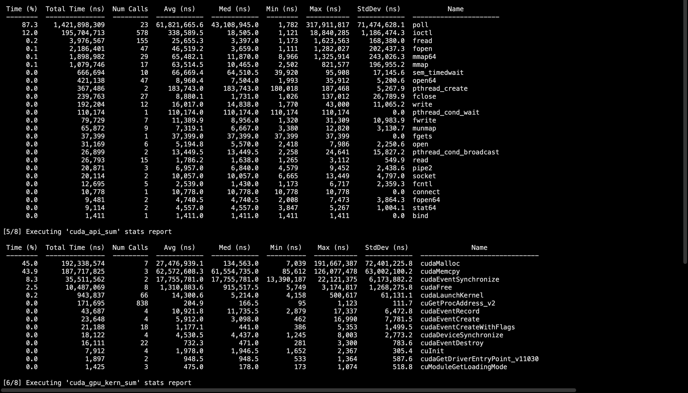
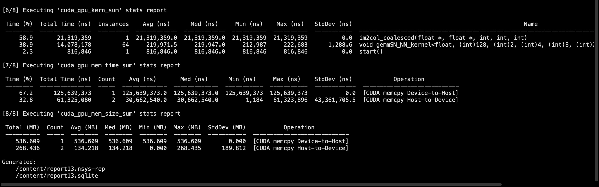

# CUDA-Accelerated Image Convolution: Explicit GEMM & Memory Optimization


## Overview
This repository contains a high-performance computer vision pipeline that computes image convolutions by transforming the spatial domain problem into a General Matrix Multiplication (GEMM) operation. By leveraging custom CUDA kernels for memory layout transformations (`im2col`) and NVIDIA's highly tuned cuBLAS library for arithmetic, this implementation completely bypasses the massive overhead of traditional nested-loop convolutions. 

The pipeline achieves a peak performance speedup of **~791x over sequential CPU execution**, capable of processing massive 8K resolution (8192x8192) images in under 40 milliseconds.

## Architectural Deep Dive

### 1. The `im2col` Transformation
Standard 2D image convolution requires sliding a filter across an image, resulting in computationally expensive, deeply nested memory accesses. This project implements the `im2col` algorithm to flatten these localized spatial patches into continuous columns of a large matrix.

While this drastically increases the memory footprint by duplicating overlapping pixel data, it converts the unpredictable sliding window operations into a single, unified matrix representation. 

### 2. Coalesced Memory Optimization
A naive implementation of `im2col` on a GPU results in heavily fragmented, uncoalesced memory writes, severely bottlenecking global memory bandwidth. 

To maximize hardware utilization, the custom `im2col` CUDA kernel in this project utilizes a **transposed memory layout**. By calculating the target matrix index such that adjacent threads in a warp write to adjacent memory addresses, the kernel guarantees fully coalesced global memory transactions. This specific optimization is critical for feeding data to the arithmetic logic units at peak bandwidth. Furthermore, this column-major alignment is natively required for optimal performance in downstream BLAS libraries.

### 3. Hardware-Accelerated Arithmetic (cuBLAS)
With the image data restructured and the filter weights flattened, the core convolution is executed as a single matrix multiplication: `Output = Filters × Im2Col_Matrix`. 

Instead of relying on custom arithmetic kernels, this project offloads the matrix multiplication to `cublasSgemm`. This utilizes NVIDIA's heavily optimized Basic Linear Algebra Subprograms, allowing the GPU to dynamically leverage advanced hardware features like Tensor Cores and optimized shared memory caching mechanisms.

## Performance Benchmarks

The implementation was rigorously profiled against a serial C++ implementation. Hardware utilization, memory throughput, and kernel execution times were analyzed using **NVIDIA Nsight Systems (`nsys`)**.

The following metrics represent the end-to-end execution time (including both `im2col` memory transformation and cuBLAS GEMM computation) using a 3x3 filter bank.

| Resolution | Total Patches | Sequential (ms) | CUDA GPU (ms) | CUDA Speedup |
| :--- | :--- | :--- | :--- | :--- |
| **16x16** | 196 | 0.0905 | 15.5375 | 0.0058x *(Bottlenecked by API overhead)* |
| **32x32** | 900 | 0.4000 | 4.5788 | 0.0874x |
| **64x64** | 3,844 | 1.7420 | 4.2489 | 0.41x |
| **128x128** | 15,876 | 7.2932 | 4.4319 | 1.64x |
| **256x256** | 64,516 | 29.3766 | 4.1505 | 7.07x |
| **512x512** | 260,100 | 117.9284 | 4.7071 | 25.05x |
| **1024x1024** | 1,044,484 | 475.5504 | 5.0362 | 94.42x |
| **2048x2048** | 4,186,116 | 1932.7011 | 6.6883 | 288.96x |
| **4096x4096** | 16,760,836 | 8034.5634 | 12.7530 | 629.98x |
| **8192x8192** | 67,092,484 | 31482.8157 | 39.7948 | **791.12x** |

*Note: For extremely small images (e.g., 16x16), the CPU outperforms the GPU due to the latency associated with PCIe memory transfers (`cudaMemcpy`) and kernel launch overhead. The GPU's massive parallelization advantage scales exponentially as the dataset size increases.*

## Getting Started

### Prerequisites
* **CUDA Toolkit:** Designed and compiled with `nvcc`.
* **cuBLAS:** Standard with the NVIDIA HPC SDK.
* **OpenCV (C++):** Required for reading, decoding, and writing image files (`cv::Mat`).

### Build Instructions
To compile the project, ensure OpenCV and CUDA are correctly configured in your environment. Use the following `nvcc` command to link the required libraries:

```bash 
nvcc -O3 parallel_CUDA_OPENCV.cu -o convolution_app `pkg-config --cflags --libs opencv4` -lcublas
```
### Execution

Run the compiled executable. You can modify the target image path and filter configurations directly within the main() function prior to compilation.

```bash
./convolution_app
```
### Profiling with Nsight Systems
To recreate the profiling reports generated during the development of this pipeline, run the executable through nsys:

```bash
nsys profile --stats=true ./convolution_app
```


This will generate an .nsys-rep file that can be visualized in the Nsight Systems GUI to inspect warp divergence, API call latency, and memory bandwidth utilization.

